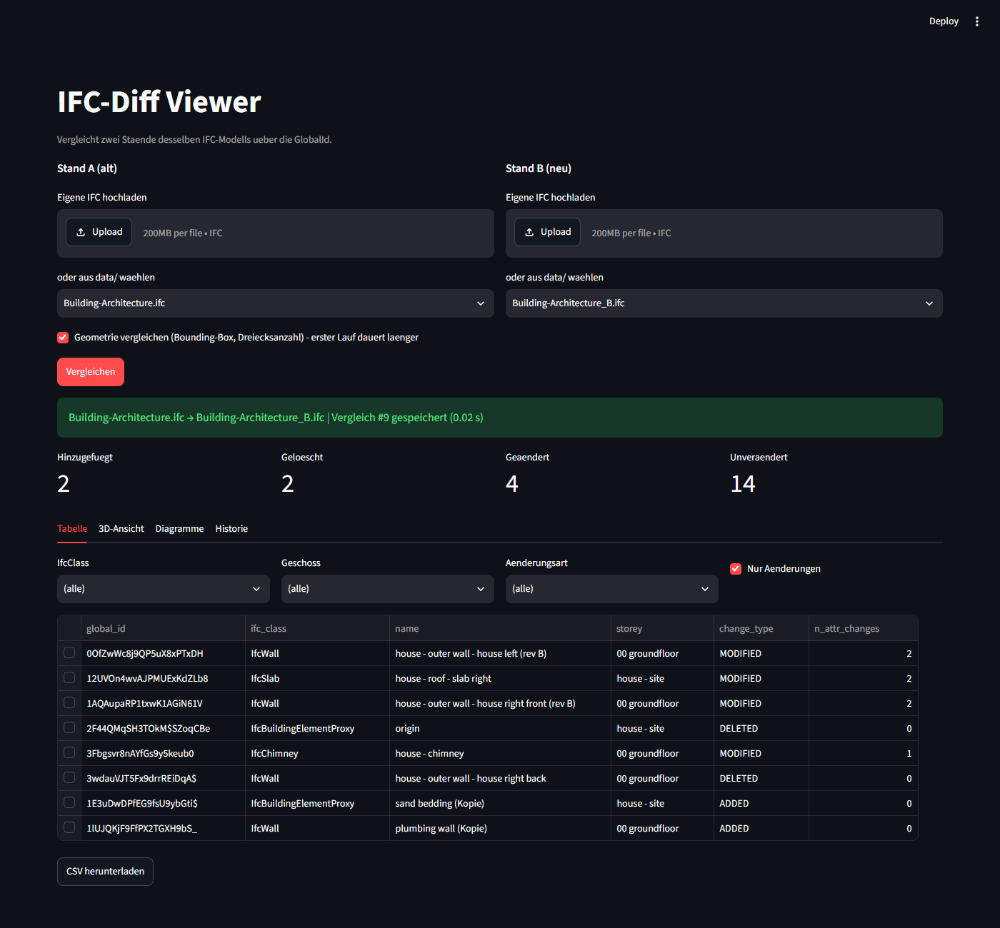
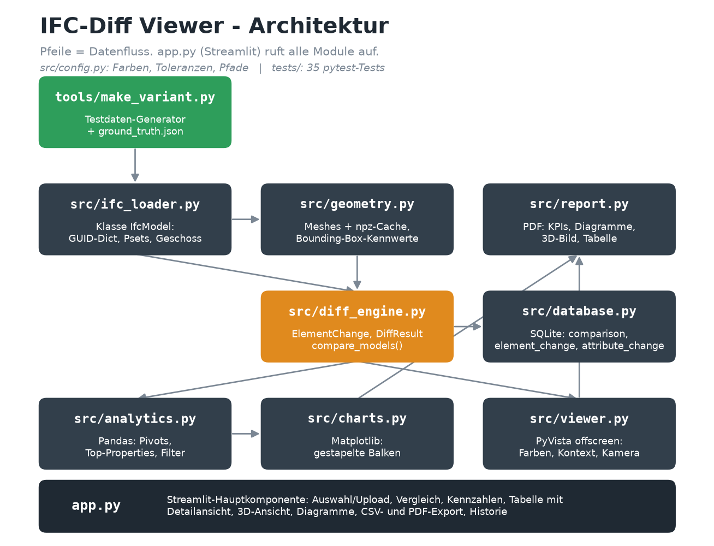
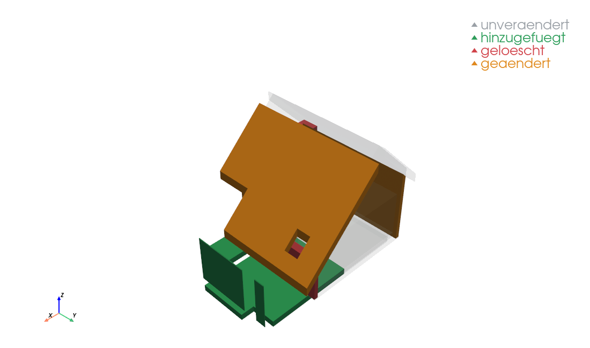
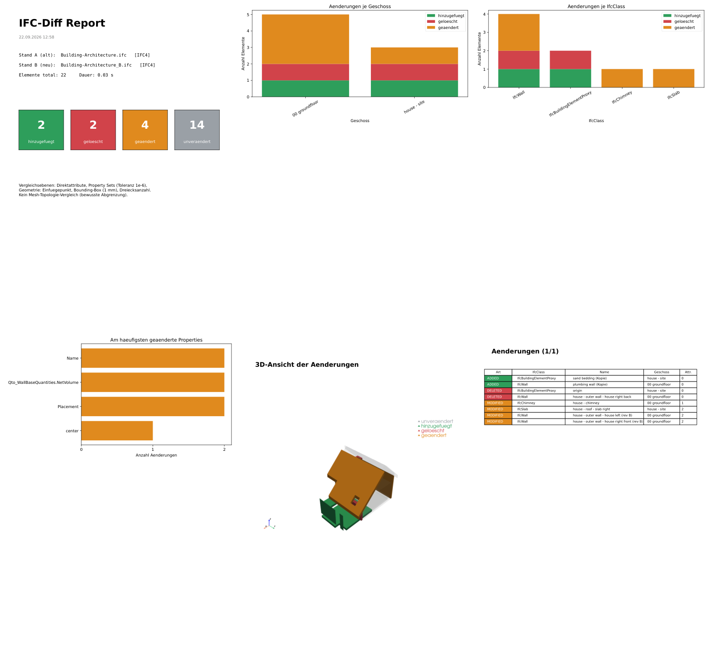

# IFC-Diff Viewer

Vergleicht zwei Staende desselben IFC-Modells und zeigt die Unterschiede
tabellarisch, statistisch und im 3D-Viewer farbcodiert an.

**Modul:** TA.BA_DT_PROGR Digital Twin Programmieren, HS26
**Studiengang:** Bachelor Digital Construction, Hochschule Luzern
**Autor:** Gian Blaser
**Repository:** https://github.com/GianBlaser/HSLU_GB_26_V2
**Themenfeld gemaess Merkblatt:** Datenauswertung und Daten-Visualisierung



---

## 1. Problemstellung und Zielsetzung

In der BIM-Koordination kommen laufend neue IFC-Staende: Architektur,
Tragwerk, Gebaeudetechnik. Die Frage **"Was hat sich seit dem letzten
Modellstand geaendert?"** wird heute meist per Sichtvergleich im Viewer oder
per Excel-Export beantwortet - fehleranfaellig, nicht reproduzierbar und nicht
dokumentiert. Kommerzielle Werkzeuge koennen das, sind aber kostenpflichtig und
in ihrer Logik nicht einsehbar.

Dieses Programm vergleicht zwei Staende **Element fuer Element ueber die
GlobalId** und beantwortet die Frage nachvollziehbar:

1. Zwei IFC-Dateien laden (Stand A = alt, Stand B = neu), aus `data/` oder per Upload
2. Elementweiser Vergleich: `ADDED` / `DELETED` / `MODIFIED` / `UNCHANGED`
3. Jeden Lauf in SQLite speichern - Historie aller Vergleiche
4. Auswertung mit Pandas: Aenderungen je Geschoss, je IfcClass, je Aenderungsart
5. Diagramme mit Matplotlib
6. 3D-Ansicht: geaenderte Elemente opak farbig, Kontext transparent
7. Export als CSV und als PDF-Report

---

## 2. Installation

Voraussetzung: Python 3.12 oder 3.13 und Git.

```bash
git clone https://github.com/GianBlaser/HSLU_GB_26_V2.git
cd HSLU_GB_26_V2
python -m venv myenv
myenv\Scripts\activate
pip install -r requirements.txt
```

Die Anwendung braucht kein weiteres Setup; Datenbank und Geometrie-Cache
werden beim ersten Start selbst angelegt.

## 3. Nutzung

```bash
streamlit run 02_Semesterprojekt/app.py
```

Der Browser oeffnet `http://localhost:8501`.

1. **Stand A (alt)** und **Stand B (neu)** waehlen - aus `data/` oder per Upload
2. Haekchen **Geometrie vergleichen** setzen (fuer die 3D-Ansicht notwendig)
3. **Vergleichen** klicken

Danach stehen vier Bereiche zur Verfuegung:

| Tab | Inhalt |
|---|---|
| **Tabelle** | Filter nach IfcClass, Geschoss, Aenderungsart; Klick auf eine Zeile zeigt die Detailansicht alt/neu; CSV-Export |
| **3D-Ansicht** | Aenderungen farbig, Kontext umschaltbar; Kamera auf das gewaehlte Element; PDF-Report |
| **Diagramme** | Aenderungen je Geschoss, je IfcClass, haeufigste Properties |
| **Historie** | alle bisherigen Vergleichslaeufe aus SQLite |

Weitere Kommandos:

```bash
# Tests
pytest 02_Semesterprojekt/tests

# Testdaten erzeugen (Stand B aus einer bestehenden Datei)
python 02_Semesterprojekt/tools/make_variant.py 02_Semesterprojekt/data/Building-Architecture.ifc --seed 42

# Architekturdiagramm neu zeichnen
python 02_Semesterprojekt/tools/make_architecture_diagram.py
```

Hinweis fuer die Weiterentwicklung: Streamlit laedt nur `app.py` automatisch
neu. Nach Aenderungen in `src/` den Server neu starten.

---

## 4. Architektur



```
02_Semesterprojekt/
├── app.py                 Streamlit-Hauptkomponente (UI, ruft die Module auf)
├── src/
│   ├── config.py          Farben, Toleranzen, Pfade - keine Magic Numbers im Code
│   ├── ifc_loader.py      Klasse IfcModel: IFC oeffnen, GUID-Dict, Psets, Geschoss
│   ├── geometry.py        Meshes erzeugen, npz-Cache, Bounding-Box-Kennwerte
│   ├── diff_engine.py     ElementChange, DiffResult, compare_models()
│   ├── database.py        SQLite: speichern und lesen
│   ├── analytics.py       Pandas: Pivots, Top-Properties, Filter
│   ├── charts.py          Matplotlib: Diagramme
│   ├── viewer.py          PyVista: 3D-Ansicht (offscreen gerendert)
│   └── report.py          PDF-Report
├── tools/
│   ├── make_variant.py               Testdaten-Generator mit Ground Truth
│   ├── smoke_test.py                 schneller Funktionstest (IFC oeffnen)
│   └── make_architecture_diagram.py  Architekturbild
├── tests/                 35 pytest-Tests
├── docs/                  Architekturbild, Screenshots, ZP1-Unterlagen
├── data/                  kleine Test-IFCs (versioniert)
├── cache/                 Geometrie-Cache (nicht versioniert)
└── output/                Datenbank, Exporte (nicht versioniert)
```

**Drei Klassen**, bewusst sparsam gehalten:

- `IfcModel` (`ifc_loader.py`) - eine geladene IFC-Datei. Haelt `elements` als
  `{GlobalId: Element}` und auf Wunsch die Meshes.
- `ElementChange` (`diff_engine.py`, `@dataclass`) - eine Aenderung an einem
  Element, mit der Liste der betroffenen Attribute.
- `DiffResult` (`diff_engine.py`, `@dataclass`) - Ergebnis eines Vergleichs:
  Liste der Aenderungen, Kennzahlen, DataFrame.

Alles andere sind Funktionen. Jeder Bereich der Oberflaeche ist eine eigene
Funktion (`show_kpis`, `show_filters`, `show_table`, `show_details`,
`show_viewer`, `show_charts`, `show_export`, `show_history`), die `main()`
zusammensetzt.

---

## 5. Kernlogik: Was gilt als "geaendert"?

**Schluessel ist die `GlobalId`** - im IFC-Standard eindeutig und ueber Exporte
stabil. Das Matching laeuft ueber ein Dictionary, nicht ueber verschachtelte
Schleifen: bei n Elementen je Datei kostet der Vergleich O(n) statt O(n²).

| Zustand | Bedingung |
|---|---|
| `ADDED` | GlobalId nur in Stand B |
| `DELETED` | GlobalId nur in Stand A |
| `MODIFIED` | in beiden, mindestens eine Vergleichsebene weicht ab |
| `UNCHANGED` | in beiden, alle Ebenen gleich |

**Drei Vergleichsebenen je Element:**

1. **Direktattribute** - `Name`, `Description`, `ObjectType`, `Tag`,
   `PredefinedType` (Liste in `config.COMPARED_ATTRIBUTES`)
2. **Property Sets** - ueber `ifcopenshell.util.element.get_psets()`, flach als
   `"Pset_X.PropY"`. Zahlen werden mit Toleranz `1e-6` verglichen, nicht mit
   `==`, weil Fliesskommawerte je Export minimal abweichen.
3. **Geometrie** - Einfuegepunkt (`ObjectPlacement`), Bounding-Box-Schwerpunkt
   und -Abmessungen (Toleranz 1 mm) sowie die Dreiecksanzahl des Meshes.

**Bewusst ausgeschlossen:** `OwnerHistory`, Zeitstempel, `IfcApplication` und
Entity-Nummern - sie aendern sich bei jedem Export, ohne dass sich die Planung
aendert.

**Farben** (zentral in `config.py`, identisch in Diagrammen, Tabelle, 3D-Ansicht
und Report):

| Zustand | Farbe | Hex |
|---|---|---|
| ADDED | Gruen | `#2E9E5B` |
| DELETED | Rot | `#D1434A` |
| MODIFIED | Orange | `#E08A1E` |
| UNCHANGED | Grau, transparent | `#9AA0A6` |

---

## 6. Abgrenzungen

Diese Grenzen sind bewusst gesetzt, nicht vergessen:

- **Kein Mesh-Topologie-Vergleich.** Die Geometrie wird ueber Einfuegepunkt,
  Bounding-Box und Dreiecksanzahl verglichen. Ein Bauteil, das bei gleicher
  Bounding-Box und gleicher Dreiecksanzahl intern anders aufgebaut ist, gilt
  als unveraendert.
- **Nur gleiche IFC-Schemata sinnvoll.** Bei IFC2x3 gegen IFC4 warnt die
  Oberflaeche; der Vergleich laeuft, das Ergebnis ist aber unsicher.
- **Neu vergebene GlobalIds koennen nicht erkannt werden.** Vergibt ein
  Werkzeug beim Export neue GUIDs, erscheint alles als `DELETED` + `ADDED`.
  Ein hoher Anteil dieser beiden Arten ist der Hinweis darauf.
- **Die 3D-Ansicht ist ein gerendertes Bild, nicht interaktiv.** Dafuer laeuft
  sie ohne Zusatzkomponenten zuverlaessig in Streamlit.

---

## 7. Testdaten und Tests

Es gibt keine oeffentlichen IFC-Datensaetze mit zwei echten Planungsstaenden;
die buildingSMART-Zertifizierungsdaten liegen nur in verschiedenen
Schema-Versionen vor. Ein Diff darauf zeigt Schema-Unterschiede, keine
Planungsaenderungen.

Deshalb erzeugt **`tools/make_variant.py`** aus einem Stand A reproduzierbar
(ueber einen Seed) einen Stand B: Elemente loeschen, verschieben, umbenennen
samt Mengenwert aendern, mit neuer GlobalId duplizieren. Die tatsaechlich
gemachten Aenderungen werden in einer `*_ground_truth.json` festgehalten.

Damit ist die Diff-Engine **automatisiert pruefbar**: jede gesetzte Aenderung
muss gefunden werden, und eine Datei gegen sich selbst muss null Aenderungen
ergeben.

```bash
pytest 02_Semesterprojekt/tests
# 35 passed
```

| Testdatei | Prueft |
|---|---|
| `test_diff_engine.py` | Vergleich gegen die Ground Truth, Toleranzen, DataFrame |
| `test_database.py` | Speichern und Lesen, Isolation zweier Laeufe |
| `test_analytics.py` | Pivots, Top-Properties, Filter, Diagramme |
| `test_geometry.py` | Mesh-Erzeugung, Cache, Bounding-Box-Vergleich |
| `test_viewer.py` | Szenenaufbau, Kontextmodi, Bildgroesse |
| `test_report.py` | PDF-Seiten, Kamera-Fokus |

**Geometrie-Cache:** Die Meshes werden als `cache/<sha1 der Datei>.npz`
abgelegt. Gemessen an `Infra-Landscaping.ifc` (2.3 MB, 101 Meshes):
0.88 s beim ersten Laden, 0.03 s aus dem Cache.

---

## 8. Entwicklungsumgebung und Module

| Bereich | Werkzeug | Einsatz |
|---|---|---|
| Sprache | Python 3.13 | venv `myenv/` im Repo-Root |
| Editor | Visual Studio Code | Python-Extension, integriertes Terminal |
| Versionskontrolle | Git + GitHub (public) | ein Commit je Etappe, Konvention `[E2] ...` |
| IFC | **IfcOpenShell 0.8.5** | Pflicht-Modul: Lesen, Psets, Container, Geometrie |
| Daten | Pandas 3.0 | Vergleichstabelle, Pivots, Filter |
| Diagramme | Matplotlib 3.11 | Diagramme und PDF-Report |
| Datenbank | SQLite (Standardbibliothek) | Historie, drei Tabellen |
| Oberflaeche | Streamlit 1.64 | Upload, Filter, Tabelle, Tabs |
| 3D | PyVista 0.49 | offscreen gerenderte Ansicht |
| Tests | pytest | 35 Tests |

Zusaetzlich NumPy (Meshes, Cache). Die Anforderung "mindestens ein externes
Modul" erfuellt IfcOpenShell.

**Datenmodell (SQLite):** `comparison` (ein Lauf mit Kennzahlen) →
`element_change` (eine Zeile je Element) → `attribute_change` (eine Zeile je
geaendertem Attribut mit Wert alt und neu).

---

## 9. Bildschirmfotos

3D-Ansicht, Kontext transparent:



PDF-Report (sechs Seiten: Titel mit Kennzahlen, Diagramme, 3D-Bild, Tabelle):



---

## 10. Entwicklungsverlauf

Das Projekt wurde in Etappen entwickelt, jede mit lauffaehigem Code, gruenen
Tests und einem eigenen Commit. Der vollstaendige Plan steht in
[PROJEKTPLAN.md](PROJEKTPLAN.md), die ZP1-Unterlagen unter `docs/ZP1/`.

| Etappe | Inhalt |
|---|---|
| 0 | Projektgeruest, Module, `config.py`, Smoke-Test |
| 1 | Testdaten-Generator mit Ground Truth |
| 2 | `IfcModel`, Diff-Engine, Tests gegen die Ground Truth |
| 3 | SQLite-Historie |
| 4 | Auswertung mit Pandas, Diagramme |
| 5 | Streamlit-Oberflaeche (Tag `v1.0-abgabefaehig`) |
| 6 | Geometrie mit npz-Cache, Bounding-Box-Vergleich |
| 7 | 3D-Ansicht mit PyVista |
| 8 | Kamera-Fokus per Zeilenklick, PDF-Report |
| 9 | Dokumentation und Praesentation |

Drei Befunde aus der Entwicklung, die im Code kommentiert sind:

- `numpy.int64` als sqlite3-Parameter liefert stillschweigend null Zeilen -
  die Lesefunktionen wandeln mit `int()` um.
- IFC-GlobalIds koennen auf `_` enden; die npz-Schluessel des Caches trennen
  deshalb mit `|`, nicht mit `__`.
- `ifcopenshell.api root.copy_class` uebernimmt die `Representation` nicht -
  der Testdaten-Generator setzt sie explizit, sonst haben Kopien keine
  Geometrie.

---

## 11. Abgaben

| Was | Wo |
|---|---|
| Programm | dieses Repository (public) |
| ZP1-Praesentation | `docs/ZP1/DT_PROGR_HS26_ZP1_GianBlaser_Praesentation.pdf` |
| MEP-Praesentation | `docs/MEP/DT_PROGR_HS26_MEP_GianBlaser_Praesentation.pdf` |
| Sprechnotizen | `docs/ZP1/Sprechnotizen_ZP1.md`, `docs/MEP/Sprechnotizen_MEP.md` |

Die Foliensaetze werden mit pptxgenjs erzeugt (`docs/*/build_slides*.js`),
damit sie reproduzierbar bleiben; der PDF-Export erfolgt aus PowerPoint.
